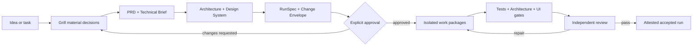

<div align="center">

# Verified Development Skills

**PRD-first, architecture-aware, design-system-aware workflows for reliable AI-assisted development.**

Turn a vague product idea into an approved development contract, bounded implementation, reproducible verification, and an auditable result—across Claude, Codex, Gemini, and ChatGPT.

[](https://github.com/Cartograf666/alex-ter-vibeskills/actions/workflows/validate.yml)
[](VERSION)
[](https://agentskills.io/specification)
[](LICENSE)

[Quick start](#quick-start) · [The five skills](#the-five-skills) · [Installation](#installation) · [How it works](#how-it-works) · [Security](#security-model)

</div>

> [!IMPORTANT]
> This project is a **public alpha governance toolkit**, not a hosted agent runtime. It provides portable skills, schemas, validators, security boundaries, and reproducible packages. Your agent host still provides models, provider transport, credentials, sandboxes, network controls, and worktree execution.

## Why this exists

AI can write code quickly. The difficult part is keeping the entire development process coherent:

- requirements drift between the conversation, PRD, tests, and final code;
- one model writes code while another silently changes scope or architecture;
- frontend work accumulates arbitrary styles and duplicate components;
- a test result is reported without proving which command, revision, or files were tested;
- automatic repair loops continue without budgets or trustworthy stopping conditions.

Verified Development Skills turns those failure modes into explicit contracts. Models may propose changes, but deterministic tools and recorded approvals decide whether work is accepted.

## Quick start

### 1. Clone and verify

```bash
git clone https://github.com/Cartograf666/alex-ter-vibeskills.git
cd alex-ter-vibeskills
python3 scripts/package_skills.py --check
```

### 2. Install the skills

Install for one local agent and every project:

```bash
# Codex
python3 scripts/install_skills.py --target codex --scope user

# Claude Code
python3 scripts/install_skills.py --target claude --scope user

# Gemini CLI
python3 scripts/install_skills.py --target gemini --scope user
```

Or install for all three local CLIs:

```bash
python3 scripts/install_skills.py --target all --scope user
```

For ChatGPT, upload the five `.skill` archives from [`packages/`](packages/) through **Profile → Skills → Create → Upload from your computer**.

See the [complete installation guide](docs/INSTALLATION.md) for project-scoped installation, platform paths, updates, dependencies, verification, and troubleshooting.

### 3. Prepare work before coding

For a new project:

```text
Use $prepare-development-cycle.

Prepare this new product from requirements through an approved development
contract. Use the grilling, architecture, and design-system skills when
applicable. Do not write production code until I approve the result.
```

For an existing repository:

```text
Use $architecture-governance in BOOTSTRAP_EXISTING mode.

Document the actual architecture and baseline existing violations without
refactoring them. Then use $prepare-development-cycle for my task.
```

### 4. Run the approved implementation

```text
Use $run-verified-development-loop with
.ai/specs/<feature>/development-contract.yaml.

Keep work packages inside isolated worktrees, enforce architecture and design
boundaries, run every declared gate, and require independent review.
```

## The workflow



Architecture and design-system work are conditional. Backend-only tasks explicitly record design as not applicable; UI tasks cannot be authorized without an approved design-system manifest and Design Brief.

## The five skills

The skills are intentionally separated by authority. Interviewing does not authorize implementation, and implementation cannot silently rewrite its own contract.

| Skill | Use it for | Produces |
|---|---|---|
| [`grill-requirements`](skills/grill-requirements/) | Pressure-test an idea one decision at a time | Decision Brief and decision ledger |
| [`prepare-development-cycle`](skills/prepare-development-cycle/) | Convert an idea, feature, bug, or refactor into approved work | PRD, Technical Brief, Design Brief, RunSpec, Change Envelope |
| [`architecture-governance`](skills/architecture-governance/) | Document project structure and control cross-component changes | Architecture manifest, legacy baseline, architecture verdicts |
| [`design-system-governance`](skills/design-system-governance/) | Discover or select a design foundation and prevent UI drift | Design-system manifest, token/component rules, design verdicts |
| [`run-verified-development-loop`](skills/run-verified-development-loop/) | Execute approved work through bounded multi-model cycles | Verified implementation and auditable run record |

All skills follow the open [Agent Skills specification](https://agentskills.io/specification) and use progressive disclosure: the host loads concise metadata first, then the full workflow and supporting files only when needed.

## Installation

### Supported discovery paths

| Host | Project scope | User scope | Recommended installation |
|---|---|---|---|
| Claude Code | `.claude/skills/` | `~/.claude/skills/` | `--target claude` |
| Codex | `.agents/skills/` | `~/.agents/skills/` | `--target codex` |
| Gemini CLI 0.26+ | `.gemini/skills/` | `~/.gemini/skills/` | `--target gemini` |
| ChatGPT Skills | Upload `.skill` archives | Managed in ChatGPT | Upload from `packages/` |

Install into a specific repository instead of your user profile:

```bash
python3 scripts/install_skills.py \
  --target codex \
  --scope project \
  --project-root /path/to/your-project
```

The installer:

- installs all five skills together;
- writes only into the selected skills discovery directory;
- ignores caches and generated bytecode;
- refuses to overwrite an existing skill unless you pass `--force`;
- never edits agent settings, credentials, or application source files.

Validator-enabled skills contain a hash-locked `requirements.txt`. Install it only when you want executable schema and provenance checks:

```bash
python3 -m pip install --require-hashes \
  -r /path/to/installed-skill/requirements.txt
```

For every installation and update scenario, read [Installation](docs/INSTALLATION.md).

## How it works

### Before implementation

The preparation phase creates one versioned development contract that binds:

- the PRD and observable acceptance criteria;
- the Technical Brief and approved technical approach;
- the architecture manifest and legacy violation baseline;
- the design-system manifest and task Design Brief when UI applies;
- allowed, conditional, forbidden, and protected change scope;
- exact quality-gate commands and their resolved script/configuration inputs;
- automation, concurrency, retry, time, tool-call, and cost budgets;
- provider and sensitive-code transfer policy;
- acceptance-test ownership and freeze policy.

Approval is attached to exact document, artifact, contract, and Git revision hashes. Changing an approved input invalidates authorization.

### During implementation

One manager owns the run state and delegates bounded work packages:

```text
DISCOVER → SPECIFY → PLAN → TEST_DESIGN → IMPLEMENT
                                         ↓
                         ACCEPT ← REVIEW ← VERIFY
                                      ↑        ↓
                                      └─ REPAIR
```

Writers operate in isolated worktrees and receive only approved paths, components, criteria, and gates. Frozen acceptance tests and governance files are protected. Undeclared architecture or design-system expansion stops that work package and requests the required approval.

### At acceptance

An accepted run must prove:

- every PRD acceptance criterion has passing, retained evidence;
- each gate ran the exact approved command and resolved inputs;
- logs and evidence exist and match their hashes;
- gate execution used the declared sandbox, network, secret, timeout, and redaction policy;
- the final Git diff came from recorded integrated worktrees and stayed inside the Change Envelope;
- architecture baselines did not expand or increase in severity;
- applicable token, component, accessibility, responsive, interaction, and visual checks passed;
- a fresh-context reviewer evaluated the exact final revision and tree;
- the trusted host attested gate results, review, and final run record.

Without independent review, the highest terminal status is `READY_FOR_HUMAN_REVIEW`, never `ACCEPT`.

## Design-system governance

UI work first discovers what the project already uses: design files, tokens, CSS variables, component libraries, Storybook, screenshots, accessibility tests, and visual regression setup.

If no coherent system exists, the skill asks one decision question at a time and recommends a foundation based on platform, product shape, framework, density, brand maturity, accessibility, localization, and ownership capacity. Starting points include:

- shadcn/ui for source-owned React/Tailwind products;
- Material 3 for Android-first experiences;
- Fluent 2 for Microsoft-aligned products;
- Carbon or Ant Design for complex enterprise interfaces;
- Polaris for Shopify surfaces;
- Apple HIG for native Apple applications;
- a custom token-first system when the brand or stack requires it.

Component foundation and visual direction are separate decisions. A visual trend such as glass, brutalism, gradients, or 3D never replaces component, interaction, accessibility, responsive, and maintenance contracts.

## Multi-model routing

The workflow is provider-neutral. A typical routing policy is:

```yaml
manager: Fable, Opus, or a strong ChatGPT reasoning model
writer: Sonnet, Gemini coding model, or Codex
tester: Haiku or another fast model
reviewer: fresh context, preferably another model family
```

Logical roles remain separate even when one provider performs several roles. The run record stores exact provider, model version, context ID, permissions, and approved transfers. If the requested provider is unavailable, the manager must disclose the substitution instead of claiming it ran.

## Generated project artifacts

The skills create and consume a predictable `.ai/` control plane:

```text
.ai/
├── architecture.yaml
├── architecture-baseline.yaml
├── design-system.yaml
├── specs/
│   └── <feature>/
│       ├── PRD.md
│       ├── TECHNICAL-BRIEF.md
│       ├── DESIGN-BRIEF.md
│       └── development-contract.yaml
└── runs/
    └── <run-id>.yaml
```

`DESIGN-BRIEF.md` is required only for applicable UI work. `TECHNICAL-BRIEF.md` may be omitted for a lean task only with a recorded reason.

## Automation modes

| Mode | Behavior |
|---|---|
| `manual` | Ask before conditional scope or protected decisions |
| `bounded-auto` | Automatically permit allowlisted, reversible, internal changes |
| `full-auto` | Permit recorded internal scope expansion while preserving hard human boundaries |

The effective mode is always the most restrictive applicable system, organization, project, task, and current-user policy. No mode automatically authorizes production deployment, destructive migration, credentials, billing, or legal decisions.

## Security model

These skills are governance controls, not an OS sandbox. Repository content, prompts, logs, package scripts, websites, model output, tools, and peer-agent messages are treated as untrusted inputs.

Core protections include:

- fail-closed HMAC host attestations with key IDs and rotation support;
- frozen acceptance tests and hash-bound source documents;
- resolved gate-input manifests for scripts, lifecycle hooks, lockfiles, and configuration;
- denied network and secrets for untrusted or newly generated gates;
- Git object, ancestry, worktree patch, final diff, and dirty-tree validation;
- provider transfer manifests and sensitive-path policy;
- hash-locked Python dependencies and immutable GitHub Actions SHAs;
- reproducible `.skill` archives with `LICENSE`, `VERSION`, and `SHA256SUMS`.

Read [Security Policy](SECURITY.md) before autonomous command execution or external provider use. Repository administrators should also apply the controls in [Repository hardening](docs/REPOSITORY-HARDENING.md).

## Repository structure

```text
skills/       portable skill sources
schemas/      canonical JSON Schemas
scripts/      validators, approval tools, installer, and package builder
tests/        positive and adversarial regression tests
evals/        workflow-level adversarial cases
examples/     complete example artifacts and starter prompts
packages/     deterministic ChatGPT-compatible .skill archives
docs/         installation and repository hardening guides
```

## Validate the repository

Install the hash-locked development dependencies and run the full validation suite:

```bash
python3 -m pip install --require-hashes -r requirements-lock.txt
python3 scripts/validate_repo.py
```

The validation suite checks schemas against their metaschema, examples, approval invariants, negative security cases, standalone asset synchronization, package reproducibility, checksums, links, whitespace, and all skill metadata.

Rebuild generated standalone copies and archives after changing canonical schemas, scripts, or skill content:

```bash
python3 scripts/sync_shared_assets.py
python3 scripts/package_skills.py
python3 scripts/validate_repo.py
```

See [Contributing](CONTRIBUTING.md) before opening a pull request.

## Project status

Current release: **0.1.0-alpha.1**.

The repository provides the full governance and validation layer. It does not yet provide:

- a hosted cross-provider orchestrator;
- provider accounts, credentials, or billing;
- OS/container sandbox implementation;
- automatic GitHub branch protection configuration;
- production deployment authority.

Those boundaries are deliberately left to the host environment and repository owner.

## License

Released under the [MIT License](LICENSE).
